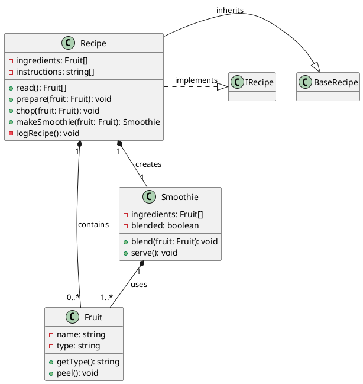

`Plain Text Diagrams` are a way of representing diagrams of code structure and behaviour in a plain text format.

Plain Text 'diagrams' - **aren't really diagrams** but are nested, indented text files that can be rapidly parsed by the human eye to gain a high level understanding of a software system. 

I call them text 'diagrams' because they are a way of representing the structure and behaviour of a codebase in a way that is similar to UML diagrams, but implemented as text, using indentation and text arrows `->` instead of boxes and arrows and graphics.

## Why

As I write on my flagship (visual) diagramming tool website [GitUML](https://www.gituml.com):

> Understanding source code is every programmer's biggest challenge

Plain Text Diagrams are a way to help you understand source code. They are a way to help you understand the structure and behaviour of a codebase. They have the advantages of UML diagrams but implemented as text, using indentation and text arrows `->` instead of boxes and arrows and graphics. Arguably they go beyond UML diagrams as they can be used to document the behaviour of a function in a way that UML diagrams cannot, inclding psuedo code narrative text, much like literate code mapping does (see my [literate code mapping](https://github.com/abulka/lcodemaps)).

## The Secret Technique Behind Every Great Programmer

I don't care how smart you are, or how many years of experience you have, understanding source code is hard.  It's hard because source code is complex - there are hundreds if not thousands of relationships between the different parts of a codebase.  

But there is one technique that every great programmer uses to understand source code, and that is some form of **code map** or abstraction artifact. Code maps are abstract representations of the structure and behaviour of a codebase. A programmer may grab a piece of paper or open a text editor and start writing class names, file names, events, variable names and function names then drawing arrows showing what calls what and what points to what. They show you how the different parts of the codebase are connected, and how they interact with each other.  Going through the proces of making some kind of code map helps you to see the big picture, or understand a slice of the codebase that you need to understand in order to debug something or add a feature.

I don't care what anybody says, you cannot keep large chunks of detail, structure and behaviour of a codebase entirely in your head - you will be more effective if you have a code map.

Such maps need not be comprehensive. Just like with UML diagrams, you only need to map what you need to tell a particular use case story or solve a particular problem.  These code maps need not be permanent - you can throw them away after you are done with them.  Or you can keep them in an archive in your git repository for future reference, even though they will be out of date, they will still be useful.

### What does a code map look like?

Every programmer is different, and I can't claim to know what code map techniques and scribbles they come up with. Personally I like to use a combination of UML class diagrams and sequence diagrams.  I like to use a rich text narrative to explain what is going on.  I like using colour to associate ideas either through coloured text, boxes or arrows. I like to number function calls to show the order of execution.  I like to cross reference ideas to show how they are related using colour, numbers or symbols.  I like to show the structure and behaviour in the same diagram.  I like to show actual code fragments or pseudo code in boxes.  

Here is an example:


Taking the code map idea to a more formal level, I have created a new diagramming methodology called Literate Code Mapping [here](https://abulka.github.io/lcodemaps/).

Here is another, quite different, example of a code map, this time of part of my [ChordJammer](/projects/websites/chordjammer) project:


Most code maps (or other abstraction artifacts) typically rely on visual tooling (hand drawings on paper or visual diagrams) thus are not maintainable in a text editor along with your source code.  Ideally you want code maps to live in comments next to your code, or in markdown files where they can be rapidly edited. This is where Plain Text 'Diagrams' come in.

## Plain Text Diagrams

Plain Text Diagrams are a way of representing diagrams of code structure and behaviour in a plain text format - not ASCII diagrams which are hard to produce, but indented approximations of what diagrams give you.  Being Plain Text means that you can rapidly update and maintain your diagrams in a text editor.  Code outlines on steroids. They are meant to be easy to read and write, and most importantly, useful.  By useful I mean you should be able to read them and gain rapid deep understanding of the source code structure and behaviour that the diagram represents.

### What does a Plain Text 'Diagram' look like?


*Plain Text class 'diagram' and sequence 'diagrams'*

### Recipe Example

Example for Recipe Construction, [example-recipe.ptd](/blog/uml/example-recipe.ptd). See above for syntax highlighted version of this example.

**Tip:** Use the vscode [Plain Text Diagram Language Extension](https://marketplace.visualstudio.com/items?itemName=wware.plain-text-diagrams) to view this file with nice syntax highlighting, folding and formatting.

```

```

### Car Example

Example for Car Management System, [example-car.ptd](/blog/uml/example-car.ptd). This example uses a variety of `[..]` directives in the sequence diagrams, like `[if ...]`, `[end]` and `[try]` etc.

**Tip:** Use the vscode [Plain Text Diagram Language Extension](https://marketplace.visualstudio.com/items?itemName=wware.plain-text-diagrams) to view this file with nice syntax highlighting, folding and formatting.

## Specification

Plain Text Diagram (PT Diagram) Notation - Specification

A lightweight, plain text format for visualizing software systems, including classes, files, variables, functions, relationships, and use cases. Designed for readability, version control, and LLM compatibility.

Plain Text 'Diagrams' are a hybrid of UML, sequence diagrams, and pseudo code. They are designed to be human-readable, version-controlled, and lightweight. They can be used to document, understand, and communicate software systems.

Like UML diagrams, we have two main types of 'diagrams':

  - Structural: Classes 'diagrams' include classes, interfaces and files with their data and behaviour listed - try to see these outlines as UML boxes. Text arrows `---->` are used to show relationships.

  - Behavioural: Sequence 'diagrams' are constructed via an indented pseudo code format. Function calls are shown with arrows, return types are shown with `<` to indicate the flow of a use case sequence.

You can update and maintain your diagrams in a text editor. They are meant to be easy to read and write, and most importantly, useful. By useful I mean you should be able to read them and gain rapid deep understanding of the source code structure and behaviour that the diagram represents.

Indentation is critical for hierarchy and readability. Use `---->` for relationships. Use `->` for function calls in use cases and `< returnType` for function return types.

### Sections (Overview)

PT Diagram notation consists of the following sections:

```
Diagram:
Imports:
Files:
Classes:
Use Cases:
  Sequence: A
  Sequence: B
  ...
```

more detail:

```
Diagram:
  name:
  version:
  version-ptd:
  description:
  files: File1.ts, File2.ts, ...

Imports:
  ...

Files:
  file: File1.ts
    Variables:
    Functions:
    Classes:
    Interfaces:

  file: File2.ts
    ...

Classes:
  class: Class1 (class1.ts) ---inherits---▷ ParentClass
    Attributes:
    Methods:

  interface: Interface1 (interface1.ts)
    Methods:

  class: Class2 (class2.ts)
    ...

Use Cases:
  Sequence: Example Call Sequence
    ...
  
  Sequence: Another sequence
    ...
```

### Diagram:
**Diagram**: System name, version, description, and files. Your Plain Text Diagram can be of a single source code file, or multiple source code files. Its scope is defined by the comma delimited list of files in the  `files:` label of the `Diagram:` section.
```plaintext
Diagram:
  name: Diagram Name
  version: 1.0
  version-ptd: Plain Text Diagram schema version e.g. 1.1
  description: Brief description. Multiple lines are fine.
  files: File1.ts, File2.ts
```

### Imports:
**Imports**: Dependencies between files. Files one per line. List the contents of each file in () e.g. `File1.ts (class Class1, function func1)` indent the relationships under the file using -->. Multiple relationships are indented under the file at the same level. Nested relationships are indented further.
```plaintext
Imports:
  Car.ts (class Car, function start, function stop)
    --> Automobile.ts (interface Automobile)
  ElectricCar.ts (class ElectricCar, function charge)
    --> Car.ts (class Car, function start)
    --> Charger.ts (class Charger, function chargeCar)
      --> Utils.ts (function calculatePower)
```

### Files:

- Lists variables, functions, and classes/interfaces for each file.
- Comments can be added using `#`.
- **File Object**:
  - Resembles a UML box with data and behavior:
    - Sections include `Variables:` and `Functions:`.
    - Additional sections for `Classes:` and `Interfaces:` can be added if needed - these sections list the names of the classes and interfaces located in the file.
- **Variables**:
  - Can have optional type annotations, denoted as `: type`.
  - Can have optional default values, denoted as `= value`.
  - Can include optional cardinality, such as `1`, `0..1`, `1..*`, or `0..*`.
  - Can have optional arrows to indicate relationships, e.g., `◇--contains--> Fruit`.
    - Relationship types can include `contains`, `owns`, `uses`, `implements`, `inherits`, `depends on`, `creates`, `diagnoses`, etc.
    - Example: `◆--contains--> Fruit` or `⋯⋯⋯creates⋯⋯⋯> Smoothie`.
- **Functions**:
  - Include parameters, return types, and annotations.
    - Parameters can have types and default values.
    - Return types are specified.
    - Annotations like `@override` can be used to indicate overriding a parent class method.
    - Functions can be marked with access modifiers, e.g., `(private)`.
  - Arrows for function parameter or return references to classes are usually omitted to reduce clutter but can be added if desired, e.g., `washes(): Car  ----returns----> Car`.
Here’s the compressed version, removing redundancies while retaining all details:
- **Arrows and Relationships**:
  - Arrows are typically reserved for variable relationships, not function parameter or return references (unless explicitly added).
  - Use of emoji characters like `◇`, `◆`, or `⋯` is optional but can enhance visual appeal:
    - Examples: `◆--contains--> Fruit` or `⋯⋯⋯creates⋯⋯⋯> Smoothie` for important relationships.
    - Plain arrows like `--contains-->` or `--creates-->` are also acceptable.
  - The number of dashes `--` or dots `⋯` in arrows is flexible and up to the user.

```plaintext
Files:
  file: File1.ts
    Variables:
      var1: Type         ◇--contains--> Type
      var2: Type = 100
      var3: Type (0..1)
      var3: Type (1..*)  ⋯⋯creates⋯⋯> Type
    Functions:
      func1(param1: Type, param2: Type): ReturnType
      func2(): void @override # Overrides a parent class method
      func3(): number (private)
    Classes:
      Class1
    Interfaces:
      Interface1
```

### Classes:
Describes classes and interfaces, including:
- **Attributes**: 
  - Can have optional default values, denoted as `= defaultValue`.
  - Can have optional `:type` and `(cardinality)` and optional arrows to the type, e.g., `--relationship--> Type`.
- **Methods**:
  - Include parameters, return types, and annotations.
  - Arrows for method parameter or return references to classes are usually omitted to reduce clutter, but can be added if desired, e.g., `runDiagnostics(car: Car)  ----diagnoses----> Car`.
- **Relationships**:
  - Inheritance or implementation relationships are shown, e.g., `class: Recipe  (Recipe.ts) --inherits--▷ BaseRecipe`.
  - For multiple relationships, the second and subsequent relationships are placed on a new line with the `-->` aligned with the first arrow.
- **Class Object**:
  - Resembles a UML box with data and behavior:
    - Sections include `Attributes:` and `Methods:`.
- **Interface Object**:
  - Similar to a class but contains no methods.
- **File Location**:
  - Class and interface names can optionally include their file location, e.g., `(somefile.ts)`.
- **Logical Grouping**:
  - All classes and interfaces from the `files:` scope in the diagram are listed in the `Classes:` section.
  - This allows for a logical grouping of classes and interfaces, even if they are located in different files.
- **Arrows and Relationships**:
  - Arrows are typically reserved for attribute relationships, not method parameter or return references (unless explicitly added).
  - Use of emoji characters like `▷` and `⋯` is optional but can enhance visual appeal.
  - Examples of emoji usage:
    - `◆---contains--->` or `⋯⋯⋯implements⋯⋯⋯▷` to mimic UML aggregation or inheritance triangles.
    - Plain arrows like `--contains-->` or `--owns-->` are also acceptable.
  - The number of dashes `--` or dots `⋯` in arrows is flexible and up to the user.
- **Visual Style**:
  - Emoji characters like `◇`, `◆`, `▷`, or `⋯` can be used to represent UML-style relationships.
  - The use of these characters is optional, and many users prefer plain arrows for simplicity.

```plaintext
Classes:
  class: Class1 (class1.ts) --inherits--▷ ParentClass (parent.ts)
                            ⋯⋯implements⋯⋯▷ Interface1 (interface.ts)
    Attributes:
      attr1: Type # Example comment
      attr2: Type = 100  ◆--contains---> Type
      attr3: Type (0..1) ⋯⋯⋯creates⋯⋯⋯> Type
      attr3: Type (owns, 1)
    Methods:
      method1(param1: Type, param2: Type): ReturnType
      method2(): void @override # Overrides a parent method

  interface: Interface1 (interface1.ts)
    Methods:
      method1(param1: Type): ReturnType
```

### Use Cases / Sequences:

Here’s the rewritten and compressed version of the **Use Cases** section in Markdown bullet points, retaining all details and nuances:

- **Use Cases**:
Describes high-level sequences combining sequence diagrams with descriptive pseudo-code.

- **Core Syntax**:
  - Use cases begin with a function call, serving as documentation for function behavior.
  - Function calls follow an indented format:  
    `-> functionName(params) [class ClassName, File.ts]`  
    (includes source annotations: source class and filename, if applicable).
  - Return types appear on a new line:  
    `< returnType`  
    Optionally, specify where the result is stored:  
    `< returnType, variable =`.
    - Use `< void` for no return value. 
    - For reduced clutter you might want to omit the `< void` line, as it is implied, and just rely on indentation to show the call has ended. However for the `.ptd` vscode extension formatter to indent your `.ptd` files correctly, you should include it.
    - Returns can be primitives or complex objects, e.g., `< {prop: type}`.
- **Control Flow**:
  - Uses bracketed annotations:  Make these up as necessary, e.g.,
    `[if]`, `[else]`, `[loop]`, `[for]`, `[switch]`, `[parallel]`, `[try]`, `[catch]`, `[finally]`, `[recurse]`, `[except]` which are followed on the next line by a `-> function()` line or pseudo-code descriptive text.
  - Annotations like `[on some event]`, `[on mouseClick]` etc. don't necessitate an indent on the next line - that's really reserved for control flow annotations like `[if]`, `[loop]`, `[try]` where the next line should be indented similarly to regular `if` or `try` statements.
  - Add whatever pseudo-code text you like inside the `[if]`, `[loop]` or `[end]` etc. lines e.g. `[if condition]`, `[loop until condition]`, `[loop until fuelLevel >= 100]`, `[end loop]`, `[end if]`.
  - You should match `[if]` with `[end]` in order for the `.ptd` vscode extension formatter to indent your `.ptd` files correctly e.g. see [example-nested.ptd](/blog/uml/example-nested.ptd). 
    - The `[end]` annotation line is handy for ending all sorts of annotations thus adding clarity. 
    - For reduced clutter you might want to omit the `[end]` line, as it is implied, and just rely on indentation to show the annotation has ended. However for the `.ptd` vscode extension formatter to indent your `.ptd` files correctly, you should include it.
  - Call Nesting is shown through nested indentation.
  - Arrows (`->`) indicate nested function calls.
  - Async function calls are preceded by `await`, e.g., `-> await function1()`.
- **Abstraction**:
  - State updates are described in natural language, focusing on key changes and purpose rather than detailed assignments.
  - Prioritizes high-level abstraction ("what" over "how").
  - Uses natural language summaries for logic and state changes.
  - Retains clear function call notation for precision.
  - Bullet points (`-`) can list sequential actions.
- **Indentation Rules**:
  - Typically two spaces.
  - Indented `-> function()` call lines are matched with corresponding `< type` lines, which are on their own line and indented more than the initiating parent call.
  - No lines can be at the same indent level as a returning `< type` line.
- **Emoji Triggers (Optional)**:
  - The first function call can start with an emoji symbol indicating the trigger:
    - `🖱️ -> ` for a mouse click event.
    - `🧍‍♂️ -> ` for a user-triggered event.
    - `📃 -> ` for code triggering other code.
  - Starting with `-> function()` or just `function()` is also fine.

Example:
```plaintext
Use Cases:
  Sequence: Example sequence 'diagram'
    🖱️ -> func1() [class Class1, File1.ts]         
           Initializes `this.snippetTree` and `this.itemTree` as empty structures.
           [if condition]
             -> func2() [class Class2, File2.ts]
               Updates `this.itemTree` with the constructed tree structure.
               Stores the tree in `this.languageIdTrees` for the given language.
               < returnType, x =
             -> blend(fruit: Fruit) [class Smoothie, Smoothie.ts]              
                < string
             -> await fsp.readdir(extensionsPath) [fs.promises]
               < string[], extensionsDirs = 
           [end]
           < returnType
```

> Note you should match `[if]` with `[end]` in order for the `.ptd` vscode extension formatter to indent your `.ptd` files correctly. See the [example-nested.ptd](/blog/uml/example-nested.ptd) file for various `Sequence:` sections using `[end]` including nested `[if]`, `[else]`, `[end]` annotations.

## Comparison with UML

### Traditional UML Class Diagram


<br>
<br>

Here is the same diagram as a Plain Text Diagram:


<br>
<br>

Sure, its not as "visual" and as effective at communicating meaning, but its not bad for a text representation.  It is a way of representing the structure of a codebase in a way that is similar to a UML class diagram, but implemented as text, using indentation and text arrows `->` instead of boxes and arrows and graphics. Put it in a comment in your source code - no problem!

### Traditional Sequence Diagram


<br>
<br>

Here is the same diagram as a Plain Text Diagram:


<br>
<br>

The `Use Cases:` section is a list of sequences, each with a sequence of function calls.  Each `Sequence:` is a "sequence diagram" in plain text. 

Instead of a diagram with arrows drawn left to right, plain text diagrams use `->` to indicate a function call.  The return type of the function is shown on the next line as `< returnType`.  The return type can optionally be followed by `, variable =` to indicate where the result is stored.  

## Discussion

### A box with data and behaviour

The paradigm of a box with data and behaviour is used throughout the notation. Classes naturally have Attributes and Methods. Did you know that Files can also be represented as boxes with data and behaviour? Files have Variables and Functions. 

> The idea that files can be treated as boxes with data and behaviour is a powerful one, and I use this idea in my [GitUML](https://www.gituml.com) tool to show the structure of a codebase. Also see my [Python UML tool](http://www.pynsource.com "Pynsource - UML tool for Python") which uses this idea to show the structure of a Python codebase by analysing python modules (files). Many programmers don't use classes for everything, and so the idea of a file as a box with data and behaviour is a useful one.

Here is how data + behaviour is championed in PT Diagram notation:

  - The PT Diagram section `Files:` is a list of files, each with Variables and Functions. 
  - The PT Diagram section `Classes:` section is a list of classes, each with Attributes and Methods. 

### Similarity to PlantUML and Mermaid markdown

The PT Diagram notation is similar to PlantUML and other markdown diagramming tools, but is arguably more human-readable because of the `-->` arrows which are trying to show relationships in a more line drawing, 'diagram-like' way. Here is the same diagram as a PlantUML markdown:


PlantUML shows relationships as special instructions each on their own line, which is less integrated and it is arguably harder for a human to reconstruct the visual picture of the relationships in their mind from a list. 

If you actually find it easier to read all the relationships in one area, then feel free to add a `Relationships:` section to the PT Diagram notation. Something like:
```plaintext
Class Relationships:
  Class1
    --> Class2 (inherits)
    --> Class3 (implements)
  Class4 --> Class5 (depends on)
  Class6
    --> Class7 (contains, 1..*)
    --> Class8 (creates, 1)
      --> Class9 (owns, 0..1)
```
or
```plaintext
Class Relationships:
  Class1
    ----inherits----▷ Class2
    ⋯⋯⋯implements⋯⋯⋯▷ Class3
  Class4 ---depends on---> Class5
  Class6
    ---contains---> Class7 (1..*)
    ⋯⋯⋯creates⋯⋯⋯> Class8 ◆---owns--> Class9
    ⋯⋯⋯creates⋯⋯⋯> Class10
      ◆---owns--> Class11
      ◆---uses--> Class12
```
however this is not part of the core PT Diagram notation, it is just a suggestion.

### Why not ASCII boxes?

```
+----------------------+    +-------------------+                    
|     BaseRecipe       |    |     IRecipe       |                    
+----------------------+    +-------------------+                    
                 ▲              ▲                                    
                 │ inherits     │implements                          
                 │                                                   
                 │              │                                    
           +-----------------------+           +--------------------+
           |       Recipe          |           |     Smoothie       |
           +-----------------------+ creates──▶+--------------------+
           | - ingredients: Fruit[]|           | - ingredients:     |
           | - instructions: str[] |           |   Fruit[]          |
           +-----------------------+           | - blended: boolean |
           | + read(): Fruit[]     |           +--------------------+
           | + prepare(fruit)      |─────┐     | + blend(fruit)     |
           | + chop(fruit)         |     │     | + serve(): void    |
           | + makeSmoothie()      |     │     +--------------------+
           | - logRecipe()         |     │               │           
           +-----------------------+ contains            │ uses      
                                       1..*              ▼           
                                         │     +--------------------+
                                         │     |      Fruit         |
                                         │     +--------------------+
                                         └────▶| - name: string     |
                                               | - type: string     |
                                               +--------------------+
                                               | + getType(): string|
                                               | + peel(): void     |
                                               +--------------------+
```
*hand crafted ascii diagram*

Yeah good luck with that.

ASCII boxes are a great way to represent classes and files, but they are not easy to create or maintain in a text editor.  In fact they are an absolute nightmare to create by hand. I used the Mac app [MonoDraw](https://monodraw.helftone.com/) to help me make the above ASCII diagram.
  

### Sequence diagram depth

Interestingly, since a scenatio starts with a function call, each use case can serve as documentation for a particular function.

You could arguably have psudeo code before the beginning function call, and after the last function call, with multiple top level function calls being listed, including what they call, and what those functions call etc.  I haven't got to that yet, but it is a possibility. Typically you would just wrap such functionality in another top level function, but I suppose there are cases where there is no such high level function? e.g.
```
Use Cases:
  Sequence: Multiple top level functions
    some psuedo code
    -> func1() [class Class1, File1.ts]
      some psuedo code
      -> func2() [class Class2, File2.ts]
        -> func3() [class Class3, File3.ts]
          < void
        < void
      < void
    < void
    some psuedo code
    -> func4() [class Class4, File4.ts]
      < void
    < void
```

So typically, use case sequences are a way of documenting the behaviour of a function. How deep you want to go with mapping function calls is up to you.  You can go as deep as you like, but remember, the purpose of the use case is to tell a story, not to document every detail of the function.  If you want to stop at a certain function call and not indent and drill down further with what it calls, that is fine.  The use case is a story, and you are the story teller. Also remember that the other function you didn't drill into can have its own sequence section where you can tell its story. 

Use case sequences of a function can 
  - just show the function calls that are in the function
  - show the function calls that are in the function and the function calls that those functions call
  - show the function calls that are in the function and the function calls that those functions call and the function calls that those functions call etc.

One useful use case sequence diagramming technique is to omit a lot of psuedo code detail and just show the function call sequence to a very deep level.  This is a way of documenting the overall function call sequence from top to botton - giving you a feel for how all the functions are connected.  For example:

```
Use Cases:
  Sequence: Deep sequence
    func1() [class Class1, File1.ts]
      -> func2() [class Class2, File2.ts]
        -> func3() [class Class3, File3.ts]
          -> func4() [class Class4, File4.ts]
            -> func5() [class Class5, File5.ts]
              -> func6() [class Class6, File6.ts]
                -> func7() [class Class7, File7.ts]
                  -> func8() [class Class8, File8.ts]
                    -> func9() [class Class9, File9.ts]
                       this is as deep as it is possible to go
                       < void
                    < void
                  < string
                < void
            < number
            -> func10() [class Class10, File10.ts]
              < void
            < void
        < void
    < void
```

Another technique is to show a lot of psuedo code detail and only show the function calls to a shallow level.  This is a way of documenting the function behaviour.  You can mix and match these techniques as you see fit.

Note that file in the `Imports:` section also are nested and indented, with the ability to show imports of imports, as deep as you like.

### Psuedo Code

You can add psuedo code text of what is going on in a use case. There is no special syntax in PT Diagram notation for such lines. Just add them as you see fit.  They are indented under the function call line.  They are not part of the function call sequence, they are just descriptive text.  They are a way of telling the story of the use case.

Psudeo code narrative text is only supported in the `Use Cases:` section.  It is not supported in the other sections.  However you can add comments after the attributes and methods in the `Classes:` section, or after the variables and functions in the `Files:` section.

## Future

`Events` are a 'thing', but I haven't got to that yet. 

`State` is a 'thing', but I haven't got to that yet. though an initial stab at it might be:

```
StateMachine:
  name: SmoothieMachine
  States:
    - Idle
    - Blending
    - Serving
  Transitions:
    - Idle -> Blending (on: startBlending)
    - Blending -> Serving (on: finishBlending)
    - Serving -> Idle (on: reset)
  Events:
    - startBlending
    - finishBlending
    - reset
```

but more work is needed on this, as I want to integrate specifics of which function calls are made in each state transition and where state is stored etc. Any ideas please let me know in the issues.

## Tools

If you save your PT Diagrams in a file with a `.ptd` or `.pt-diagram` filename, you can use the [Plain Text Diagram Language Extension](https://marketplace.visualstudio.com/items?itemName=wware.plain-text-diagrams) for Visual Studio Code. Nice syntax highlighting and folding.

Version `1.1.1` now supports automatic formatting of `.ptd` files.  Just right click in the editor and select `Format Document` or use the keyboard shortcut `Shift+Alt+F` (or `Shift+Opt+F` on Mac).

## Generating PT Diagrams

- By hand
- Ask an AI to do it
- Use an app to do it (doesn't exist yet)

If you want to generate PT Diagrams from your source code automatically, you can ask an AI to do it:
- feed it the `Specification` portion of [this blog post as markdown](https://raw.githubusercontent.com/abulka/abulka.github.io/refs/heads/master/content/blog/plain-text-diagrams.md) (search for `## Specification`)
- feed it some examples (search for `### Recipe Example`, `### Car Example`) 
- ask the AI to generate a PT Diagram for you, pasting in the source code you wish the PT Diagram to represent.

I've found that feeding an AI an example `.ptd` file is enough - feeding in the whole specification is usually unecessary. 

Your mileage may vary, and for the AI to generate a PT Diagram from source code, you need a large context window so the little 7B models you run at home probably won't do a good job, but DeepSeek, ChatGPT, Claude and Vscode CoPilot will do a suprisingly reasonable job.

Ideally there would be a dedicated app, website or vscode extension that would do this for you.  I am thinking about this.

## Final Thoughts

Plain Text Diagrams are a way of representing diagrams of code structure and behaviour in a plain text format.  They help you understand source code. You can come back to a project after a long time and read the PT Diagrams to understand what is going on.  You can use them to explain to others how the code works.  You can use them to solve problems.  You can use them to be a better programmer.

I'd love to hear your thoughts on this notation.  Please raise an issue on the [github repo](https://github.com/abulka/vscode-pt-diagrams/issues) if you have any suggestions or questions. Or send me an email at abulka@gmail.com.

## References

These are traditional (visual) diagramming tools and methodologies that I have created:

- [GitUML](https://www.gituml.com) Generate diagrams rapidly from GitHub Repositories, supports customisation via PlantUML markup.
- [Literate Code Mapping](https://github.com/abulka/lcodemaps) An evolution of UML for today's software development needs - still visual, but more expressive and more useful.
- [Vscode Extension](https://marketplace.visualstudio.com/items?itemName=wware.plain-text-diagrams) for Plain Text Diagrams.
