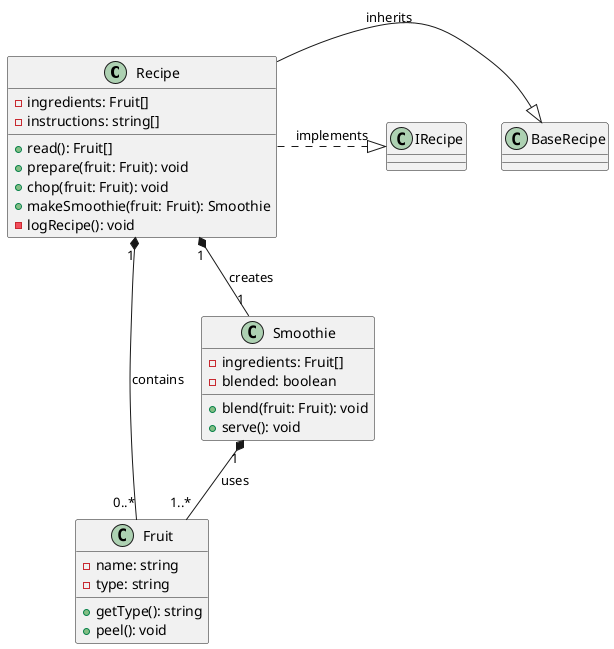

`Plain Text Diagrams` are a way of representing diagrams of code structure and behaviour in a plain text format.

Plain Text 'diagrams' - **aren't really diagrams** but are nested, indented text files that can be rapidly parsed by the human eye to gain a high level understanding of a software system. 

I call them text 'diagrams' because they are a way of representing the structure and behaviour of a codebase in a way that is similar to UML diagrams, but implemented as text, using indentation and text arrows `->` instead of boxes and arrows and graphics.

## Why

As I write on my flagship (visual) diagramming tool website [GitUML](https://www.gituml.com):

> Understanding source code is every programmer's biggest challenge

Plain Text Diagrams are a way to help you understand source code. They are a way to help you understand the structure and behaviour of a codebase. They have the advantages of UML diagrams but implemented as text, using indentation and text arrows `->` instead of boxes and arrows and graphics. Arguably they go beyond UML diagrams as they can be used to document the behaviour of a function in a way that UML diagrams cannot, inclding psuedo code narrative text, much like literate code mapping does (see my [literate code mapping](https://github.com/abulka/lcodemaps)).

## The Secret Technique Behind Every Great Programmer

I don't care how smart you are, or how many years of experience you have, understanding source code is hard.  It's hard because source code is complex - there are hundreds if not thousands of relationships between the different parts of a codebase.  

But there is one technique that every great programmer uses to understand source code, and that is some form of **code map** or abstraction artifact. Code maps are abstract representations of the structure and behaviour of a codebase. A programmer may grab a piece of paper or open a text editor and start writing class names, file names, events, variable names and function names then drawing arrows showing what calls what and what points to what. They show you how the different parts of the codebase are connected, and how they interact with each other.  Going through the proces of making some kind of code map helps you to see the big picture, or understand a slice of the codebase that you need to understand in order to debug something or add a feature.

I don't care what anybody says, you cannot keep large chunks of detail, structure and behaviour of a codebase entirely in your head - you will be more effective if you have a code map.

Such maps need not be comprehensive. Just like with UML diagrams, you only need to map what you need to tell a particular use case story or solve a particular problem.  These code maps need not be permanent - you can throw them away after you are done with them.  Or you can keep them in an archive in your git repository for future reference, even though they will be out of date, they will still be useful.

### What does a code map look like?

Every programmer is different, and I can't claim to know what code map techniques and scribbles they come up with. Personally I like to use a combination of UML class diagrams and sequence diagrams.  I like to use a rich text narrative to explain what is going on.  I like using colour to associate ideas either through coloured text, boxes or arrows. I like to number function calls to show the order of execution.  I like to cross reference ideas to show how they are related using colour, numbers or symbols.  I like to show the structure and behaviour in the same diagram.  I like to show actual code fragments or pseudo code in boxes.  

Here is an example:


Taking the code map idea to a more formal level, I have created a new diagramming methodology called Literate Code Mapping [here](https://abulka.github.io/lcodemaps/).

However most code maps rely on visual tools (drawings on paper or visual diagrams) thus are not easily maintained in a text editor.  Ideally you want code maps to live in comments next to your code, or in markdown files. This is where Plain Text 'Diagrams' come in.

## Plain Text Diagrams

Plain Text Diagrams are a way of representing diagrams of code structure and behaviour in a plain text format - not ASCII diagrams which are hard to produce, but indented approximations of what diagrams give you.  Being Plain Text means that you can rapidly update and maintain your diagrams in a text editor.  They are meant to be easy to read and write, and most importantly, useful.  By useful I mean you should be able to read them and gain rapid deep understanding of the source code structure and behaviour that the diagram represents.

### What does Plain Text Diagram Syntax look like?


*beginning of a PT Diagram file*


<br/>
<i>a class 'diagram' in PT Diagram notation</i>
<br/>
<br/>


*sequence 'diagrams'*

### Recipe Example

Example for Recipe Construction, [example-recipe.ptd](/blog/uml/example-recipe.ptd)

```

```

### Car Example

Example for Car Management System, [example-car.ptd](/blog/uml/example-car.ptd)

Uses various `[..]` directives in the sequence diagrams (see Use Cases: section)

```

```

### Treeview Example

Example for Treeview Construction, [example-treeview.ptd](/blog/uml/example-treeview.ptd)

```

```

The above Use Case (sequence diagram as text) example represents the logic of some Treeview construction code, representing the functionality of my vscode extension [Snippets Explorer](/projects/libraries/snippets-explorer/) which shows vscode source code snippets in a treeview. This sequence 'diagram' example includes features like `[if]`, `[else]` and plenty of psuedo code descriptive text.

## Specification

Plain Text Diagram (PT Diagram) Notation - Specification

A lightweight, plain text format for visualizing software systems, including classes, files, variables, functions, relationships, and use cases. Designed for readability, version control, and LLM compatibility.

Plain Text 'Diagrams' are a hybrid of UML, sequence diagrams, and pseudo code. They are designed to be human-readable, version-controlled, and lightweight. They can be used to document, understand, and communicate software systems.

Like UML diagrams, we have two main types of 'diagrams':

  - Structural: For example classes and files are listed with their data and behaviour - try to see them as boxes. Some class relationships are indicated with arrows. 

  - Behavioural: Sequence 'diagrams' are constructed via an indented pseudo code format. Function calls are shown with arrows, return types are shown with `<`, and work well to indicate the flow of a use case scenario.

You can update and maintain your diagrams in a text editor. They are meant to be easy to read and write, and most importantly, useful. By useful I mean you should be able to read them and gain rapid deep understanding of the source code structure and behaviour that the diagram represents.

Indentation is critical for hierarchy and readability. Use `-->` for relationships. Use `->` for function calls in use cases and `< returnType` for function return types.

### Sections (Overview)

PT Diagram notation consists of the following sections:

```
Diagram:
Files:
Classes:
Class Relationships:
Imports:
Use Cases:
  Scenario: A
  Scenario: B
  ...
```

more detail:

```
Diagram:
  name:
  version:
  description:
  files: File1.ts, File2.ts, ...

Files:
  file: File1.ts
    Variables:
    Functions:
    Classes:
    Interfaces:

  file: File2.ts
    ...

Classes:
  class: Class1 (class1.ts) --> ParentClass
    Attributes:
    Methods:

  interface: Interface1 (interface1.ts)
    Methods:

  class: Class2 (class2.ts)
    ...

Class Relationships:
  ...

Imports:
  ...

Use Cases:
  Scenario: Example Call Sequence
    ...
  
  Scenario: Another Scenario
    ...
```

### Diagram:
1. **Diagram**: System name, version, description, and files. Your Plain Text Diagram can be of a single source code file, or multiple source code files. Its scope is defined by the comma delimited list of files in the  `files:` label of the `Diagram:` section.
```plaintext
Diagram:
  name: Diagram Name
  version: 1.0
  description: Brief description.
  files: File1.ts, File2.ts
```

### Files:
2. **Files**: Lists variables, functions (with parameters, return types, and annotations), and classes/interfaces for each file. Comments can be added using `#`. The file: objects are like UML boxes with data + behaviour e.g. Variables: and Functions:. Additional sections for Classes: and Interfaces: can be added if needed - these just list the names of the classes and interfaces living in this particular file. Variables can have optional type `: type`, default value ` = value` followed by an optional tuple containing `(relationship type, cardinality)` where relationship type is just a free form description of the relationship e.g. `contains`, `owns`, `uses`, `implements`, `inherits`, `depends on`, `creates`, `diagnoses`. The cardinality is a string like `1`, `0..1`, `1..*`, `0..*`. Functions can have parameters with types and default values, and return types. Functions can have annotations like `@override` to indicate that they override a parent class method. Functions can be listed as `(private)` or some other access modifier.
```plaintext
Files:
  file: File1.ts
    Variables:
      var1: Type # Example comment
      var2: Type = 100 # Optional default value
      var3: Type (0..1) # Optional cardinality
      var3: Type (contains, 1..*) # Optional relationship
    Functions:
      func1(param1: Type, param2: Type): ReturnType
      func2(): void @override # Overrides a parent class method
      func3(): number (private)
    Classes:
      Class1
    Interfaces:
      Interface1
```

### Classes:
3. **Classes**: Describes classes and interfaces, including their attributes, methods (with parameters, return types, and annotations), and relationships (inheritance or implementation) e.g. `class Recipe --> BaseRecipe (inherits)`. Where there are multiple class and interface relationships, the second and subsequent relationships are placed on a new line with the `-->` lining up with the first arrow (see example below). 
The class: object is like a UML box with data + behaviour e.g. Attributes: and Methods:. The interface: object is like a class but with no methods.
Attributes can have optional default values with `= defaultValue`, and optional relationships with `(relationship, cardinality)` and optional arrows to the type `--> Type`. Class and Interface names can optionally be followed by (somefile.ts) indicating their location. 
All the classes from all the files in the Diagram scope `files:` are listed in the `Classes:` section, allowing a 'logical' grouping of classes and interfaces, meaning you can list all the classes in one place, even though they are in different files.
```plaintext
Classes:
  class: Class1 (class1.ts) --> ParentClass (parent.ts) (inherits) 
                            --> Interface1 (interface.ts) (implements)
    Attributes:
      attr1: Type # Example comment
      attr2: Type = 100 --> Type (uses, 1)
      attr3: Type (0..1)
      attr3: Type (owns, 1)
    Methods:
      method1(param1: Type, param2: Type): ReturnType
      method2(): void @override # Overrides a parent method

  interface: Interface1 (interface1.ts)
    Methods:
      method1(param1: Type): ReturnType
```

### Class Relationships:
4. **Class Relationships**: Describes relationships between classes and interfaces, including optional relationship annotation (uses, contains, owns, etc.) and optional cardinality (e.g., 1, 1..*, 0..1). Single or multiple relationships. If one relationship, use `Class1 --> Class2 (relationship)`. For multiple relationships, indent the relationships under the class.  Nested relationships are indented further.
Whilst you can show relationships between classes in the `Classes:` section, this section is for summarizing all the relationships in one place, and is needed if you want to show nested class relationships e.g. for expressing the the chain: `Class6` uses `Class8` which in turn creates `Class9`.
```plaintext
Class Relationships:
  Class1
    --> Class2 (inherits)
    --> Class3 (implements)
  Class4 --> Class5 (depends on)
  Class6
    --> Class7 (contains, 1..*)
    --> Class8 (creates, 1)
      --> Class9 (owns, 0..1)
```

### Imports:
5. **Imports**: Dependencies between files. Files one per line. List the contents of each file in () e.g. `File1.ts (class Class1, function func1)` indent the relationships under the file using -->. Multiple relationships are indented under the file at the same level. Nested relationships are indented further.
```plaintext
Imports:
  Car.ts (class Car, function start, function stop)
    --> Automobile.ts (interface Automobile)
  ElectricCar.ts (class ElectricCar, function charge)
    --> Car.ts (class Car, function start)
    --> Charger.ts (class Charger, function chargeCar)
      --> Utils.ts (function calculatePower)
```

### Use Cases / Scenarios:
6. **Use Cases**:  Use Case Notation describes high-level scenarios combining sequence diagrams with descriptive pseudo-code. Core syntax: Function calls follow indented format `-> functionName(params) [class ClassName, File.ts]` with source annotations [source class (if applicable), filename]. Return types appear on a new line as `< returnType` followed by optional `, variable =` to specify where result is stored; `< void` is optional for no return value. Returns can be primitives or complex objects like `< {prop: type}`. Control flow uses bracketed annotations [if], [else], [loop], [parallel], [try], [catch], [finally], [recurse] with nesting shown through indentation and arrows (`->`) indicating nested function calls. Variables are referenced in backticks (e.g. `` `variableName` ``) with state updates described in natural language, focusing on key changes and purpose rather than detailed assignments. The notation prioritizes high-level abstraction and "what" over "how", using natural language summaries for logic and state changes while retaining clear function call notation. Since use cases begin with a function call, they can serve as documentation for function behavior itself. Bullet points (-) can be used to list sequential actions.async function calls can be preceded by e.g. `-> await function1()`. 
Indenting is typically two spaces, indented `-> function()` call lines are matched with corresponding `< type` line which is on its own line and indented more than the initialting parent call. It is impossible for there to be lines at the same indent level as a returning `< type` line. [if condition] and other annotations like [try] are followed by a `-> function()` line or psudo code descriptive text which is indented, like the way a regular if or try statements work.
Example:
```plaintext
Use Cases:
  Scenario: Example Scenario
    func1() [class Class1, File1.ts]         
      Initializes `this.snippetTree` and `this.itemTree` as empty structures.
      [if condition]
        -> func2() [class Class2, File2.ts]
          Updates `this.itemTree` with the constructed tree structure.
          Stores the tree in `this.languageIdTrees` for the given language.
          < returnType, x =
        -> blend(fruit: Fruit) [class Smoothie, Smoothie.ts]              
           < string, currentFruit =
        -> await fsp.readdir(extensionsPath) [fs.promises]
          < string[], extensionsDirs = 
      < returnType
```

## Comparison with UML

### Traditional UML Class Diagram


<br>
<br>

Here is the same diagram as a Plain Text Diagram:


<br>
<br>

Sure, its not as "visual" and as effective at communicating meaning, but its not bad for a text representation.  It is a way of representing the structure of a codebase in a way that is similar to a UML class diagram, but implemented as text, using indentation and text arrows `->` instead of boxes and arrows and graphics. Put it in a comment in your source code - no problem!

### Traditional Sequence Diagram


<br>
<br>

Here is the same diagram as a Plain Text Diagram:


<br>
<br>

The `Use Cases:` section is a list of scenarios, each with a sequence of function calls.  Each `Scenario:` is a "sequence diagram" in plain text. 

> Perhaps `Scenario:` should be renamed `Sequence:`?

Instead of a diagram with arrows drawn left to right, plain text diagrams use `->` to indicate a function call.  The return type of the function is shown on the next line as `< returnType`.  The return type can optionally be followed by `, variable =` to indicate where the result is stored.  

## Discussion

### Paradigm of a box with data and behaviour

The paradigm of a box with data and behaviour is used throughout the notation. Classes naturally have Attributes and Methods. Did you know that Files can also be represented as boxes with data and behaviour? Files have Variables and Functions. 

> The idea that files can be treated as boxes with data and behaviour is a powerful one, and I use this idea in my [GitUML](https://www.gituml.com) tool to show the structure of a codebase. Also see my [Python UML tool](http://www.pynsource.com "Pynsource - UML tool for Python") which uses this idea to show the structure of a Python codebase by analysing python modules (files). Many programmers don't use classes for everything, and so the idea of a file as a box with data and behaviour is a useful one.

Here is how data + behaviour is championed in PT Diagram notation:

  - The PT Diagram section `Files:` is a list of files, each with Variables and Functions. 
  - The PT Diagram section `Classes:` section is a list of classes, each with Attributes and Methods. 

### Similarity to PlantUML and Mermaid markdown

The PT Diagram notation is similar to PlantUML and other markdown diagramming tools, but is arguably more human-readable because of the `-->` arrows which are trying to show relationships in a more line drawing, 'diagram-like' way. Here is the same diagram as a PlantUML markdown:


PlantUML shows relationships as special instructions each on their own line, which is less integrated and it is arguably harder for a human to reconstruct the visual picture of the relationships in their mind from a list.

Sure, PT Diagrams, also have a `Class Relationships:` section where all the relationships are listed, one per line. But this section is a redundant, summary of the relationship shown in the Classes section and is entirely optional. Use it if you feel it adds value (see section below on Relationships).

### Why not ASCII boxes?

```
+----------------------+    +-------------------+                    
|     BaseRecipe       |    |     IRecipe       |                    
+----------------------+    +-------------------+                    
                 ▲              ▲                                    
                 │ inherits     │implements                          
                 │                                                   
                 │              │                                    
           +-----------------------+           +--------------------+
           |       Recipe          |           |     Smoothie       |
           +-----------------------+ creates──▶+--------------------+
           | - ingredients: Fruit[]|           | - ingredients:     |
           | - instructions: str[] |           |   Fruit[]          |
           +-----------------------+           | - blended: boolean |
           | + read(): Fruit[]     |           +--------------------+
           | + prepare(fruit)      |─────┐     | + blend(fruit)     |
           | + chop(fruit)         |     │     | + serve(): void    |
           | + makeSmoothie()      |     │     +--------------------+
           | - logRecipe()         |     │               │           
           +-----------------------+ contains            │ uses      
                                       1..*              ▼           
                                         │     +--------------------+
                                         │     |      Fruit         |
                                         │     +--------------------+
                                         └────▶| - name: string     |
                                               | - type: string     |
                                               +--------------------+
                                               | + getType(): string|
                                               | + peel(): void     |
                                               +--------------------+
```
*hand crafted ascii diagram*

Yeah good luck with that.

ASCII boxes are a great way to represent classes and files, but they are not easy to create or maintain in a text editor.  In fact they are an absolute nightmare to create by hand. I used the Mac app [MonoDraw](https://monodraw.helftone.com/) to help me make the above ASCII diagram.
  
#### Relationships

Philosophically, there are other paradigms besides data and behaviour. Relationships are a `thing`, so we have a `Class Relationships:` section and an `Imports:` section. 

The `Imports:` section is a list of files with relationships to other files. 

The `Class Relationships:` section is a list of classes with relationships to other classes. 


<br>
<br>

#### Sequence diagram depth

Interestingly, since a scenatio starts with a function call, each use case can serve as documentation for a particular function.

You could arguably have psudeo code before the beginning function call, and after the last function call, with multiple top level function calls being listed, including what they call, and what those functions call etc.  I haven't got to that yet, but it is a possibility. Typically you would just wrap such functionality in another top level function, but I suppose there are cases where there is no such high level function? e.g.
```
Use Cases:
  Scenario: Multiple top level functions
    some psuedo code
    -> func1() [class Class1, File1.ts]
      some psuedo code
      -> func2() [class Class2, File2.ts]
        -> func3() [class Class3, File3.ts]
          < void
        < void
      < void
    < void
    some psuedo code
    -> func4() [class Class4, File4.ts]
      < void
    < void
```

So typically, use case scenarios are a way of documenting the behaviour of a function. How deep you want to go with mapping function calls is up to you.  You can go as deep as you like, but remember, the purpose of the use case is to tell a story, not to document every detail of the function.  If you want to stop at a certain function call and not indent and drill down further with what it calls, that is fine.  The use case is a story, and you are the story teller. Also remember that the other function you didn't drill into can have its own scenario section where you can tell its story. 

Use case scenarios of a function can 
  - just show the function calls that are in the function
  - show the function calls that are in the function and the function calls that those functions call
  - show the function calls that are in the function and the function calls that those functions call and the function calls that those functions call etc.

One useful use case sequence diagramming technique is to omit a lot of psuedo code detail and just show the function call sequence to a very deep level.  This is a way of documenting the overall function call sequence from top to botton - giving you a feel for how all the functions are connected.  For example:

```
Use Cases:
  Scenario: Deep Scenario
    func1() [class Class1, File1.ts]
      -> func2() [class Class2, File2.ts]
        -> func3() [class Class3, File3.ts]
          -> func4() [class Class4, File4.ts]
            -> func5() [class Class5, File5.ts]
              -> func6() [class Class6, File6.ts]
                -> func7() [class Class7, File7.ts]
                  -> func8() [class Class8, File8.ts]
                    -> func9() [class Class9, File9.ts]
                       this is as deep as it is possible to go
                       < void
                    < void
                  < string
                < void
            < number
            -> func10() [class Class10, File10.ts]
              < void
            < void
        < void
    < void
```

Another technique is to show a lot of psuedo code detail and only show the function calls to a shallow level.  This is a way of documenting the function behaviour.  You can mix and match these techniques as you see fit.

Note that file in the `Imports:` section also are nested and indented, with the ability to show imports of imports, as deep as you like.

#### Psuedo Code

You can add psuedo code text of what is going on in a use case. There is no special syntax in PT Diagram notation for such lines. Just add them as you see fit.  They are indented under the function call line.  They are not part of the function call sequence, they are just descriptive text.  They are a way of telling the story of the use case.

Psudeo code narrative text is only supported in the `Use Cases:` section.  It is not supported in the other sections.  However you can add comments after the attributes and methods in the `Classes:` section, or after the variables and functions in the `Files:` section.

## Future

`Events` are a 'thing', but I haven't got to that yet. 

`State` is a 'thing', but I haven't got to that yet. though an initial stab at it might be:

```
StateMachine:
  name: SmoothieMachine
  States:
    - Idle
    - Blending
    - Serving
  Transitions:
    - Idle -> Blending (on: startBlending)
    - Blending -> Serving (on: finishBlending)
    - Serving -> Idle (on: reset)
  Events:
    - startBlending
    - finishBlending
    - reset
```

but more work is needed on this, as I want to integrate specifics of which function calls are made in each state transition and where state is stored etc. Any ideas please let me know in the issues.

## Tools

If you save your PT Diagrams in a file with a `.ptd` or `.pt-diagram` filename, you can use the [Plain Text Diagram Language Extension](https://marketplace.visualstudio.com/items?itemName=wware.plain-text-diagrams) for Visual Studio Code. Nice syntax highlighting and folding.

## Generating PT Diagrams

- By hand
- Ask an AI to do it
- Use an app to do it (doesn't exist yet)

If you want to generate PT Diagrams from your source code automatically, you can ask an AI to do it:
- feed it the `Specification` portion of [this blog post as markdown](https://raw.githubusercontent.com/abulka/abulka.github.io/refs/heads/master/content/blog/plain-text-diagrams.md) (search for `## Specification`)
- feed it some examples (search for `### Recipe Example`, `### Car Example` or `### Treeview Example`) 
- ask the AI to generate a PT Diagram for you, pasting in the source code you wish the PT Diagram to represent.

Ideally there would be a dedicated app, website or vscode extension that would do this for you.  I am thinking about this.

## Final Thoughts

Plain Text Diagrams are a way of representing diagrams of code structure and behaviour in a plain text format.  They help you understand source code. You can come back to a project after a long time and read the PT Diagrams to understand what is going on.  You can use them to explain to others how the code works.  You can use them to solve problems.  You can use them to be a better programmer.

## References

These are traditional (visual) diagramming tools and methodologies that I have created:

- [GitUML](https://www.gituml.com) Generate diagrams rapidly from GitHub Repositories, supports customisation via PlantUML markup.
- [Literate Code Mapping](https://github.com/abulka/lcodemaps) An evolution of UML for today's software development needs - still visual, but more expressive and more useful.
- [Vscode Extension](https://marketplace.visualstudio.com/items?itemName=wware.plain-text-diagrams) for Plain Text Diagrams.
